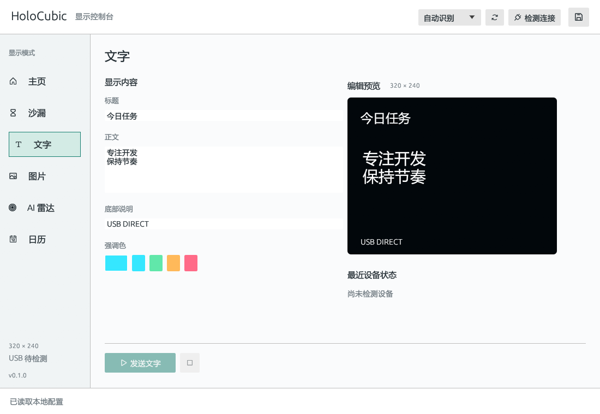
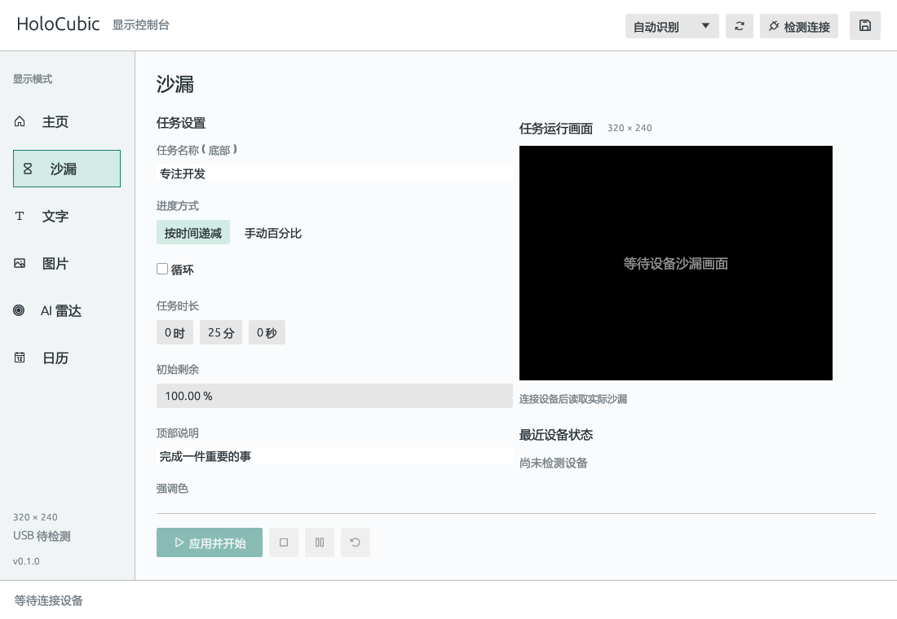
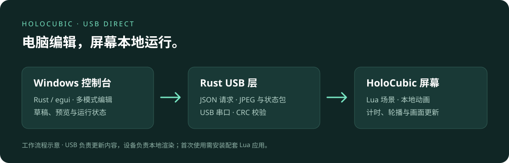

# HoloCubic Display

[](https://github.com/smallcat2333/holocubic-display/actions/workflows/ci.yml)
[](LICENSE)

**用 USB，把沙漏、文字、图片、AI 雷达和日历送到 HoloCubic 棱镜屏。**

A Windows single-EXE Rust/egui controller with Lua scenes for HoloCubic (`@HCUSB/1`).



*程序实际界面的离线默认状态，仅使用演示参数，未连接设备；这不是设备实拍图。*

<details>
<summary>查看沙漏设置界面</summary>



</details>

## 可以做什么

- 沙漏：任务名称、倒计时、精确百分比，支持暂停、继续、重置与循环。
- 文字和图片：电脑端 Rust 渲染中文，适配 320×240 屏幕。
- 主页：按配置在设备本地轮播，不需要电脑逐帧传图。
- AI 雷达：展示本机 CLI 统计和公共雷达网站的信息。
- 日历：只读 CalendarTask 当天事项，内容变化后才更新设备。



## 开始使用

需要 Windows 10/11 x64，以及匹配本项目 Lua 接口的 HoloCubic/ESP32-S3 设备。电脑必须能够访问设备串口。**运行时不再需要 Python。**

### 下载运行包

在 [Actions](https://github.com/smallcat2333/holocubic-display/actions/workflows/ci.yml) 中选择成功的构建，下载 `holocubic-display-windows-x64` 并**完整解压**。在解压目录执行：

```powershell
.\rs_holocubic\rs_holocubic.exe
```

保留 EXE 同目录的 `assets/`（字体与图标）；设备 Lua 位于相邻 `device_app/`。这是单一可执行文件分发，不依赖 PATH 中的 `python`。

首次使用需将 `device_app/` 中的应用文件安装到设备 `/sd/apps/usb_display/`，然后从设备 Launcher 启动 USB Display。步骤见 [设备安装与 USB 使用](docs/USB_GUIDE.md)。连接热点只用于初次安装，日常控制走 USB；AI 雷达采集由电脑访问网络，日历需要本机 CalendarTask 数据。

### 从源码构建

安装 Rust stable 与 Visual Studio C++ 桌面构建工具，在**仓库根目录**运行：

```powershell
cargo test --locked
cargo build --release --locked
cargo run --release --locked -p rs_holocubic
```

根目录是 Cargo workspace，Rust 源码位于 `rs_holocubic/`。双击本机构建的 `target/release/rs_holocubic.exe` 也可以运行；对外分发请使用 `pwsh -File scripts/package.ps1` 生成仅含 EXE 与资源的完整包。

## 验证与说明

```powershell
cargo test --locked
cargo build --release --locked
```

GitHub CI 运行 Rust 自动测试并构建完整 Windows 包，不连接真实设备、不读取个人日历或账号。Lua 场景和真实硬件仍需手动验证；历史记录和各模式细节见 [控制台说明](rs_holocubic/README.md)。

本项目是个人社区工具，与硬件厂商、OpenAI、Anthropic 或 CalendarTask 无官方隶属关系。截图和文档不包含个人任务数据。

## 贡献与许可

问题反馈请使用 Issues，参与方式见 [CONTRIBUTING.md](CONTRIBUTING.md)。原创代码采用 [MIT License](LICENSE)，随附字体采用 SIL OFL，见 [第三方声明](THIRD_PARTY_NOTICES.md)。

## 变更记录

2026-09-23 | 0.1.0 | 完成纯 Rust 迁移：USB/场景/采集/JPEG 渲染全部进程内完成；移除 Python 运行时与 bridge.py；单 EXE 打包。

2026-09-10 | 0.1.0 | 迁移为独立公开仓库，新增根目录构建入口、便携包脚本定位、界面图、MIT 许可和 Windows CI；保留设备端与 Python 通信实现。

2026-09-10 | 0.1.0 | 显式关闭雷达只读 SQLite 连接和测试夹具，修复 Windows / Python 3.11 下临时数据库被占用的问题；补充连接释放回归断言。
